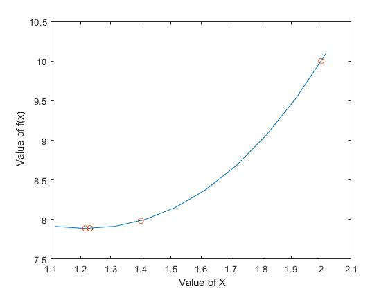

# Stochastic optimization algorithm HP1
## Newton raphson algorithm
This is an introductory home problem to the Stochastic optimization algorithm course

A program that takes as input (the coefficients of) an nth degree polynomial and a
starting point, and which then uses Newton-Raphson’s method to find the nearest stationary point of the polynomial.

# Setting up the environment
1. Install Matlab
1. Add the all the content to the current working directory.

# Set up the code
1. Execute the main file.
